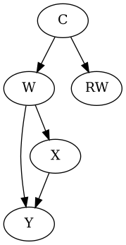

<!DOCTYPE html>
<html lang="pt-BR">
<head>
<meta charset="UTF-8">
<title>DAGs e Missing Data</title>

</head>

<body>

<h1>DAGs e Verificação de Missing Data</h1>

Esta seção contém os DAGs causais e scripts utilizados para validar os mecanismos de missing data implementados nos DGPs do projeto.

<ul>
    <li>MCAR</li>
    <li>MAR</li>
    <li>MNAR</li>
</ul>

<h2>Estrutura</h2>

<pre>
figure generator/
│
├── figure generator/
    └── figure_DAG_gen.py
├── testes/
    └── verify_dsep.py
├── images/
│   ├── mar_graph.png
    └──... TODO
├── mar_graph.py
├── mnar_self_graph.py
├── proxy_mnar_graph.py
│
└── mar_graph.png
</pre>

<h2>MAR</h2>

No cenário MAR, o mecanismo de missing depende apenas das variáveis observadas C.

W indep RW | C

Após controlar C, o indicador de missing RW não contém mais informação sobre W.

<h2>Self-MNAR</h2>

No cenário self-MNAR, o missing depende diretamente da própria variável ausente.

W NOT indep RW | C

<h2>Proxy-MNAR</h2>

No cenário proxy-MNAR, o missing depende de uma variável latente U.

<h2>Verificação de d-separation</h2>

O arquivo <code>verify_dsep.py</code> realiza verificações programáticas de independência condicional.

<table>
    <tr>
        <th>Cenário</th>
        <th>W indep RW | C</th>
    </tr>

    <tr>
        <td>MAR</td>
        <td>True</td>
    </tr>

    <tr>
        <td>MNAR</td>
        <td>False</td>
    </tr>
</table>

<h2>Validação Empírica</h2>

Os mecanismos também foram avaliados empiricamente utilizando regressões do tipo:

<pre>
W1 ~ RW1 + C
</pre>

<table>
    <tr>
        <th>Cenário</th>
        <th>RW significativo após controlar C?</th>
    </tr>

    <tr>
        <td>MAR</td>
        <td>Não</td>
    </tr>

    <tr>
        <td>MNAR</td>
        <td>TODO</td>
    </tr>
</table>

</body>
</html>